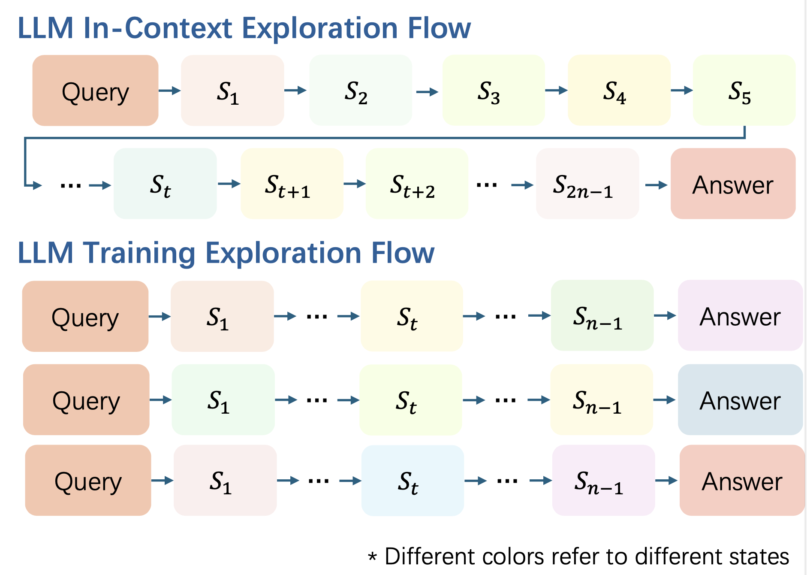
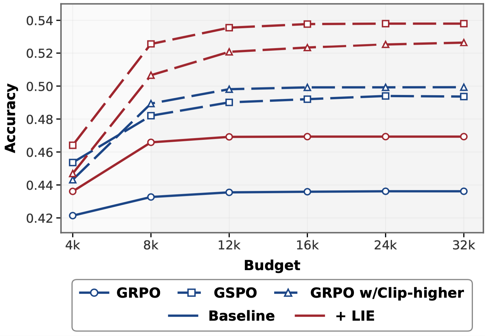

<div align="center">


<h1 style="display: flex; justify-content: center; align-items: center; gap: 10px; margin: 0;">
  Think Longer to Explore Deeper: Learn to Explore In-Context via Length-Incentivized Reinforcement Learning
</h1>
<p align="center"><em>A simple yet effective recipe that encourages models to explore more via length-incentivized rewards and redundancy penalties.</em></p>

<div align="center">
  
</div>


[](https://arxiv.org/abs/2602.11748) [](https://github.com/futingwang/LIE) [](https://opensource.org/licenses/MIT)


</div>

---

# 📚 Overview
- 📖 [Introduction](#introduction)  
- 🚀 [Key Method](#key-method)  
- 📊 [Results](#results)  
- 🔧 [Usage](#usage)  
- 🎈 [Citation](#citation)  
- 🌻 [Acknowledgement](#acknowledgement)  
- 📬 [Contact](#contact)  

---

# 📖Introduction

We identify that effective test-time scaling requires **In-Context Exploration**, but the probability of sampling longer reasoning trajectories decays exponentially during autoregressive generation. To bridge this gap, we propose **Length-Incentivized Exploration (LIE)**, which encourages models to explore more via a **Length-Based Reward** and a **Redundancy Penalty**. Experiments on Qwen3 and Llama show LIE achieves **+4.4% in-domain** and **+2.7% OOD** improvements over GRPO/GSPO baselines.

---

# 🚀Key Method

Our framework distinguishes between exploration during training and in-context inference. LIE breaks the "Shallow Exploration Trap" by shaping the reward function as follows:

$$R = R_{acc} + R_{len} + \beta \cdot R_{red}$$

*   **$R_{acc}$ (Accuracy Reward):** Standard outcome-based reward.
*   **$R_{len}$ (Length-Incentivized Reward):** Encourages the model to extend its reasoning process when it fails to answer correctly, creating a curriculum for "thinking longer."
*   **$R_{red}$ (Redundancy Penalty):** A penalty term to discourage repetitive tokens and maximize **In-Context Distinct State Count ($C_{context}$)**.

---

# 📊Results

LIE demonstrates superior performance and scaling capabilities compared to baselines.

## Main Results (Qwen3-4B-Base)

| Model                 |   MATH   | Olympiad |   AMC    |   AIME   |  AIME25  | **Avg (In-Domain)** |  ARC-c   |   GPQA   | MMLU-Pro |  **Avg (OOD)**  |
| :-------------------- | :------: | :------: | :------: | :------: | :------: | :-----------------: | :------: | :------: | :------: | :-------------: |
| Qwen3-4B-Base         |   66.0   |   33.2   |   36.6   |   8.5    |   6.9    |        30.2         |   66.9   |   26.3   |   30.9   |      41.4       |
| GRPO                  |   80.4   |   47.1   |   55.2   |   16.8   |   18.7   |        43.6         |   84.6   |   44.4   |   60.1   |      63.0       |
| **GRPO + LIE**        | **85.0** | **49.9** | **60.5** | **22.9** | **16.4** |   **46.9 (+3.3)**   | **90.3** | **46.5** | **60.4** | **65.7 (+2.7)** |
| GSPO                  |   85.2   |   51.7   |   62.7   |   26.7   |   20.5   |        49.4         |   88.4   |   48.5   |   61.5   |      66.1       |
| **GSPO + LIE (Ours)** | **88.4** | **57.2** | **66.2** | **30.5** | **26.7** |   **53.8 (+4.4)**   | **91.4** | **47.5** | **63.8** | **67.6 (+1.5)** |

## Test-Time Scaling
Our recipe exhibits a superior scaling curve when increasing inference compute budget, avoiding the saturation or degradation seen in standard RL models.



---

# 🔧Usage

## Training with LIE
The training scripts are placed in `verl/recipe/length_src/scripts`:

```bash
# GRPO + LIE
bash lie_grpo.sh
# GSPO + LIE
bash lie_gspo.sh
```

## Evaluation
We provide an evaluation script to reproduce our results:

```bash
cd eval_scripts
bash eval.sh
```

## Repo Structure

This repository includes:

- `verl/recipe/length_src`: Core implementation of LIE.
- `verl/recipe/length_src/scripts`: Training scripts for GRPO, GSPO, and their LIE variants.
- `eval_scripts`: Eval scripts for models.
- `assets`: Figures used in this README.

---

# 🎈Citation

If you find this work useful, please cite our paper:

```bibtex
@misc{wang2026thinklongerexploredeeper,
      title={Think Longer to Explore Deeper: Learn to Explore In-Context via Length-Incentivized Reinforcement Learning}, 
      author={Futing Wang and Jianhao Yan and Yun Luo and Ganqu Cui and Zhi Wang and Xiaoye Qu and Yue Zhang and Yu Cheng and Tao Lin},
      year={2026},
      eprint={2602.11748},
      archivePrefix={arXiv},
      primaryClass={cs.CL},
      url={https://arxiv.org/abs/2602.11748}, 
}
```

---

# 🌻Acknowledgement

This project is built upon [veRL](https://github.com/volcengine/verl). We thank the authors for their open-source contribution. Evaluation relies on [Math-Verify](https://github.com/huggingface/Math-Verify).

---

# 📬 Contact

For questions, feedback, or collaboration opportunities, feel free to reach out:
- Futing Wang: wangfuting@westlake.edu.cn

